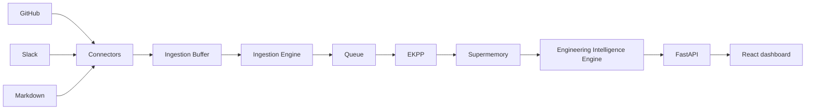

# DecisionLens

DecisionLens turns scattered engineering conversations into searchable, evidence-backed organizational intelligence. It captures GitHub, Slack, and Markdown context through the existing pipeline, then presents decisions, tradeoffs, trends, and architecture history in one focused workspace.

## Product tour

- **Overview** — decision, tradeoff, architecture-change, activity, and open-question signals.
- **Ask DecisionLens** — grounded answers with confidence, citations, and related artifacts.
- **Architecture timeline** — the evolution from identity and RLS to caching, Kafka, and background workers.
- **Recurring discussions / trends / decision history** — persistent context for the questions engineering teams revisit.
- **Markdown upload** — sends ADRs and RFCs to the existing `POST /api/v1/upload/markdown` endpoint.

The dashboard uses polished fixture fallbacks for a smooth local demo. When Supermemory and the FastAPI service are configured, it automatically prefers live API responses.

## System design



The backend layering is intentionally preserved: the dashboard only consumes the established FastAPI endpoints.

## Repository layout

```text
backend/                 FastAPI, ingestion, memory, and intelligence contracts
frontend/                React + TypeScript + Vite + Tailwind dashboard
sample-data/             GitHub, Slack, and Markdown demo corpus
scripts/seed.py          Connector-to-Supermemory demo seed pipeline
docs/demo.md             Judge-ready demo flow and talking points
docs/adr/                Architecture decision records
```

## Quick start

1. Copy the environment template and set the Supermemory settings used by your deployment.

   ```bash
   cp .env.example .env
   ```

2. Start the full stack.

   ```bash
   docker compose up --build
   ```

3. Open the dashboard at [http://localhost:5173](http://localhost:5173). The API health endpoint is [http://localhost:8000/api/v1/health](http://localhost:8000/api/v1/health).

4. Seed realistic organizational memory once `SUPERMEMORY_BASE_URL` is configured.

   ```bash
   python scripts/seed.py
   ```

## Local development

```bash
python -m pip install -r requirements.txt
uvicorn backend.app.main:app --reload

cd frontend
pnpm install
pnpm dev
```

Set `VITE_API_BASE_URL` when the API runs anywhere other than `http://localhost:8000/api/v1`.

## Screenshots

| Overview | Ask DecisionLens | Architecture timeline |
| --- | --- | --- |
| _Add dashboard screenshot here_ | _Add chat screenshot here_ | _Add timeline screenshot here_ |

## Demo

Use the complete [demo guide](docs/demo.md) for a guided walkthrough, useful audience questions, and expected outputs.

## Future work

- Persist and expose ingestion job status for the upload progress view.
- Add authenticated workspace configuration and source-management controls.
- Add richer visualizations for change impact and entity relationships.
- Support real-time response streaming when the backend exposes a streaming endpoint.
