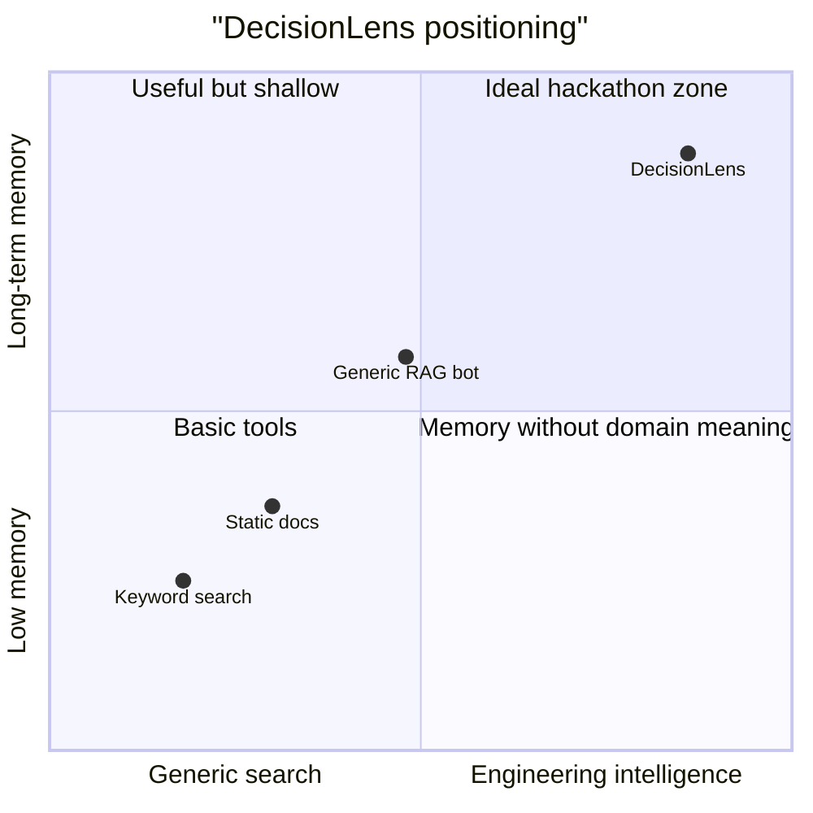
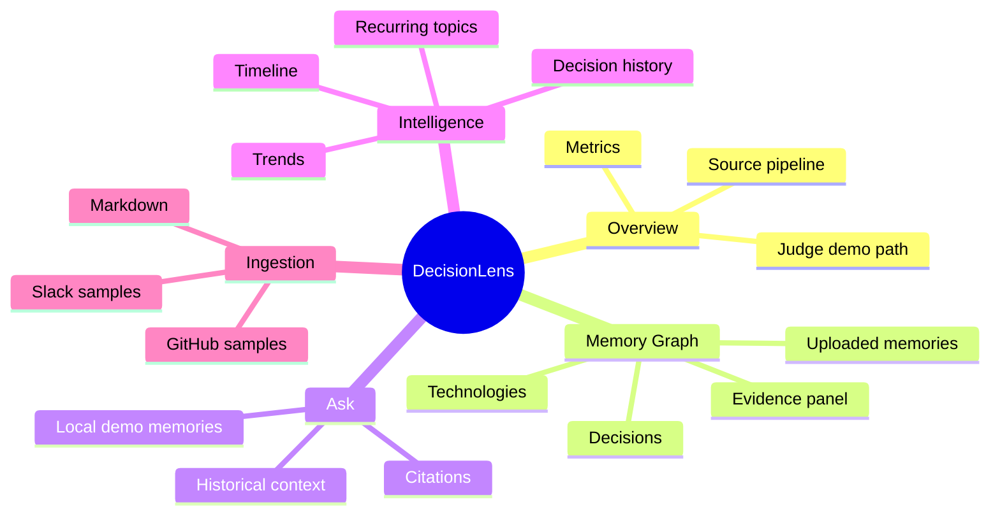
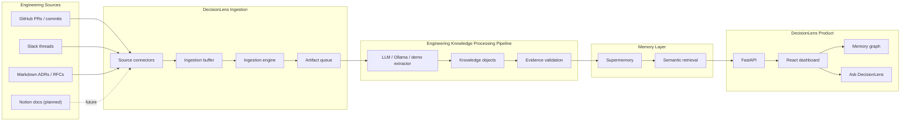
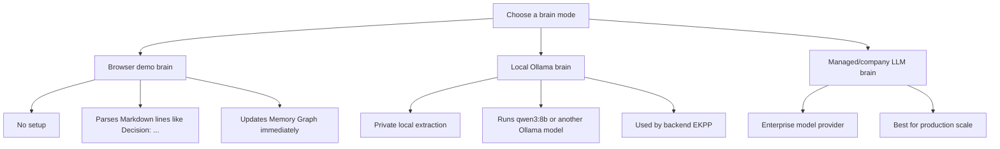
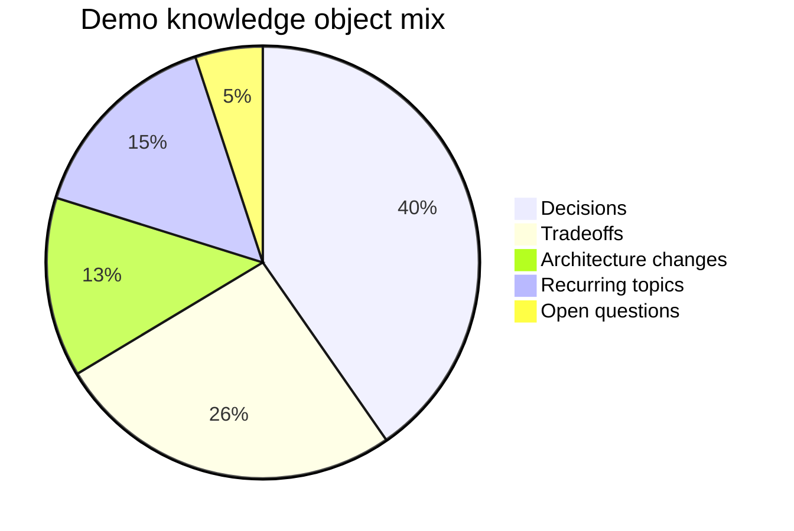
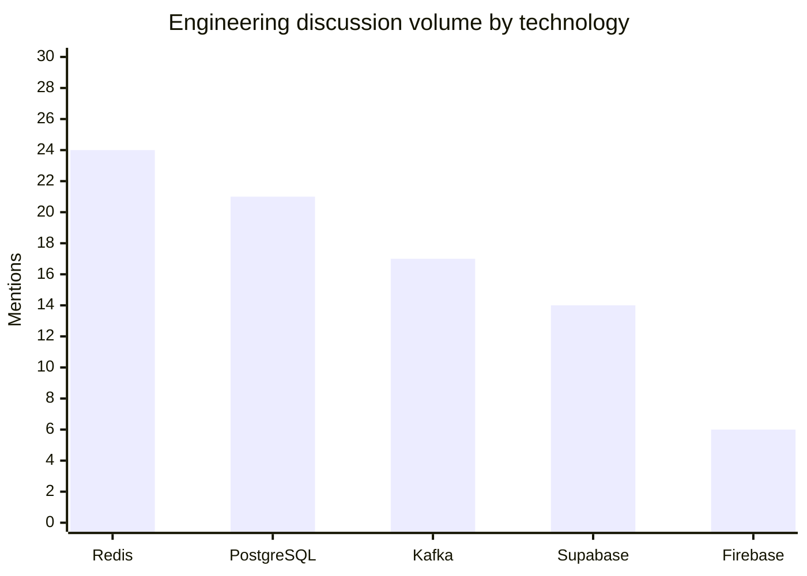
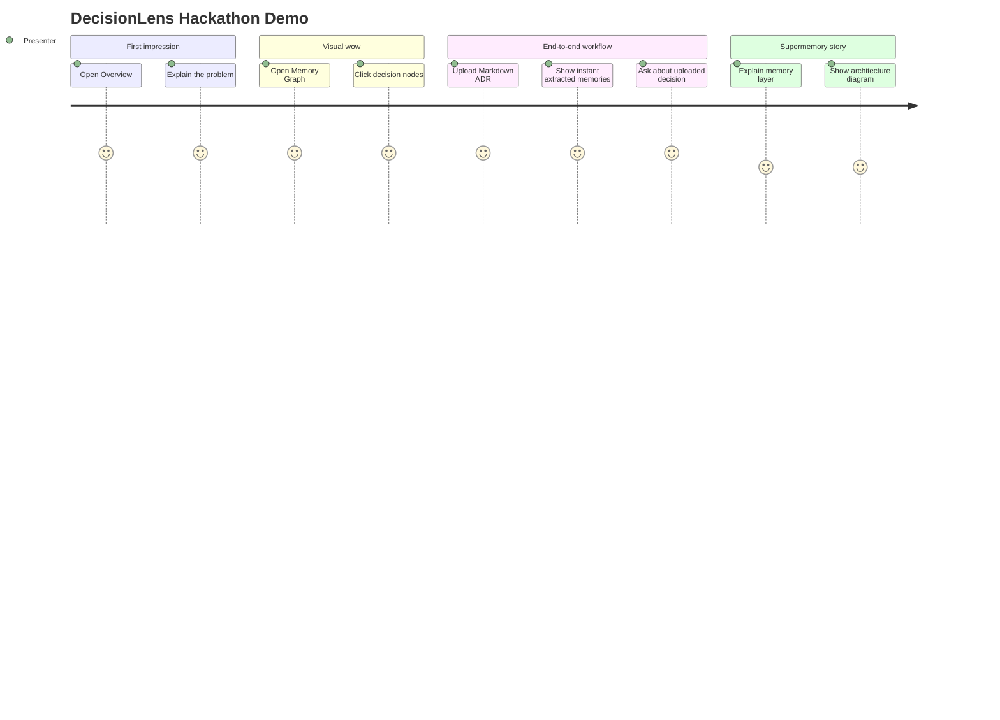
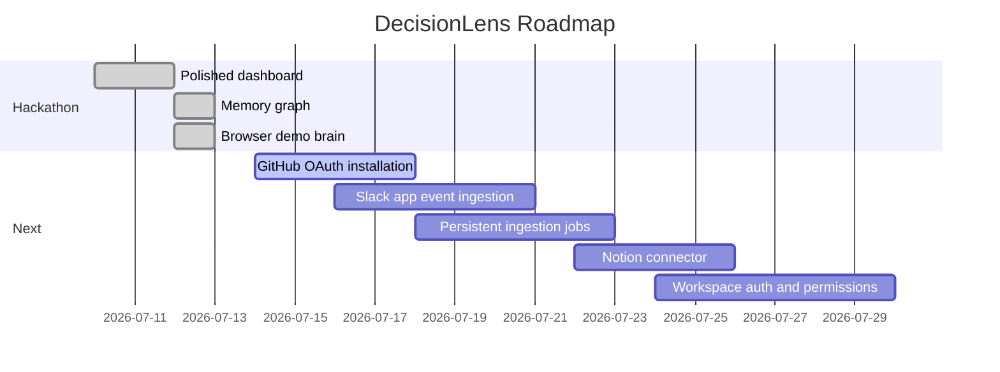
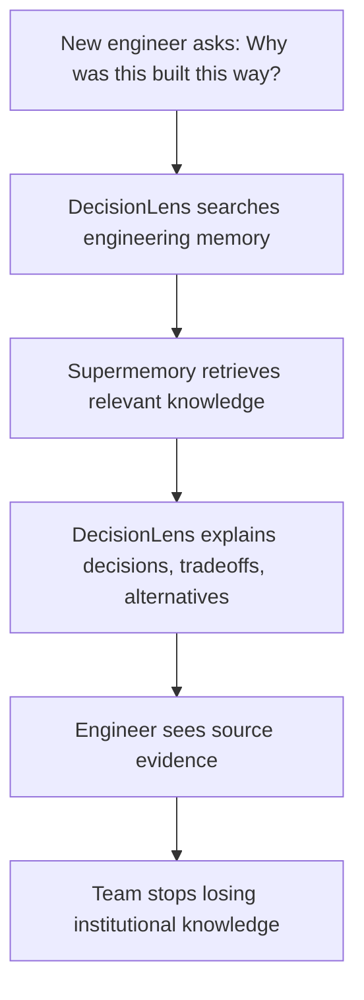

# 🧠 DecisionLens

<p align="center">
  <strong>Engineering memory for teams that cannot afford to forget why decisions were made.</strong>
</p>

<p align="center">
  DecisionLens turns GitHub, Slack, and Markdown discussions into searchable, evidence-backed organizational intelligence powered by Supermemory.
</p>

<p align="center">
  
  
  
  
  
</p>

---

## 🔗 Submission Links

| Item | Link |
| --- | --- |
| 🚀 Live deployment | [decision-lens.netlify.app](https://agent-6a54fce0eb46362cdafc6cd7--decision-lens.netlify.app/) |
| 💻 Public GitHub repository | [github.com/riddhimajaiswal18/decisionlens](https://github.com/riddhimajaiswal18/decisionlens.git) |
| 🐦 Tweet / X post | [x.com/i/status/2078329346322796996](https://x.com/i/status/2078329346322796996) |

---

## ✨ Product Poster

```text
┌──────────────────────────────────────────────────────────────────────────────┐
│                                                                              │
│   🧠 DecisionLens                                                            │
│                                                                              │
│   Raw engineering conversations                                              │
│          ↓                                                                   │
│   Evidence-backed decisions, tradeoffs, alternatives, timelines              │
│          ↓                                                                   │
│   A living memory graph for your engineering organization                    │
│                                                                              │
│   GitHub  •  Slack  •  Markdown  •  Supermemory  •  Ollama-ready             │
│                                                                              │
└──────────────────────────────────────────────────────────────────────────────┘
```

> **One-line pitch:** DecisionLens is an engineering intelligence workspace that answers questions like _“Why did we choose Redis?”_ using the actual conversations, pull requests, ADRs, and tradeoffs behind the decision.

---

## 🚀 Why DecisionLens Exists

Engineering teams make important decisions every day, but the reasoning often disappears inside:

| Source | What Gets Lost | Why It Matters |
| --- | --- | --- |
| GitHub PRs | tradeoffs, rejected approaches, implementation rationale | future developers only see the final code |
| Slack threads | informal decisions, unresolved concerns, ownership clues | valuable context becomes unsearchable noise |
| ADRs/RFCs | historical architecture choices | documents become stale without linked evidence |
| Onboarding chats | repeated explanations | senior engineers lose time repeating context |

DecisionLens does not behave like a generic document search tool. It extracts **structured engineering knowledge** and keeps the original evidence attached.

---

## 🏆 Hackathon Value



DecisionLens demonstrates a concrete Supermemory use case:

```text
Raw engineering artifacts → structured knowledge objects → Supermemory → decision intelligence UI
```

---

## 🧩 What It Can Do Now

| Capability | Status | Description |
| --- | --- | --- |
| 📊 Overview dashboard | ✅ Working | high-level engineering memory metrics and demo path |
| 🕸️ Memory graph | ✅ Working | Obsidian-style interactive map of decisions, technologies, artifacts, and uploaded memories |
| 💬 Ask DecisionLens | ✅ Working | asks questions against live API data or demo/local memories |
| 🕰️ Architecture timeline | ✅ Working | shows source-grounded decision evolution |
| 🔁 Recurring discussions | ✅ Working | identifies topics that keep returning |
| 📈 Technology trends | ✅ Working | compares adoption/rejection signals |
| 📜 Decision history | ✅ Working | traces how a technology or decision evolved |
| 📤 Markdown upload | ✅ Working | queues files through FastAPI and creates immediate local demo memories |
| 🧠 Local browser demo brain | ✅ Working | tests extraction without Ollama or Supermemory |
| 🦙 Ollama extraction | 🟡 Supported | backend extraction provider is implemented; requires local model setup |
| 🧬 Supermemory integration | 🟡 Supported | client, serializer, seed path, and intelligence endpoints exist; requires configured service |
| 🔌 GitHub/Slack connectors | 🟡 Basic | connector code and sample seeding exist; production OAuth/app setup is future work |
| 🧱 Notion connector | ⚪ Planned | not implemented yet, but fits the Artifact connector contract |

---

## 🖼️ Product Tour

| Area | Experience |
| --- | --- |
| **Overview** | polished command center for judges and teammates |
| **Memory Graph** | interactive visual map inspired by Obsidian knowledge graphs |
| **Ask DecisionLens** | source-grounded answers with evidence and confidence |
| **Timeline** | architecture evolution from identity to caching to event pipelines |
| **Trends** | adoption/rejection signals across technologies |
| **Upload** | instant no-LLM demo extraction from Markdown |

### Demo UI Shape



---

## 🏗️ System Architecture



---

## 🧠 Brain Modes

DecisionLens is designed so you can demo quickly and scale later.



| Mode | Requires LLM? | Requires Supermemory? | Best For |
| --- | --- | --- | --- |
| Browser demo brain | ❌ No | ❌ No | hackathon demo, quick testing |
| Ollama brain | ✅ Local | 🟡 Recommended | privacy-first local extraction |
| Managed LLM brain | ✅ Hosted | ✅ Yes | production/company deployment |

**Supermemory is the long-term semantic memory layer.**
**The brain is the extractor that turns raw artifacts into structured knowledge before storage.**

---

## 📊 Demo Intelligence Snapshot





---

## ⚡ Quick Start

### 1. Clone and configure

```bash
git clone https://github.com/riddhimajaiswal18/decisionlens.git
cd decisionlens
cp .env.example .env
```

### 2. Run with Docker

```bash
docker compose up --build
```

Open:

- Dashboard: [http://localhost:5173](http://localhost:5173)
- API health: [http://localhost:8000/api/v1/health](http://localhost:8000/api/v1/health)

### 3. Run locally without Docker

Backend:

```bash
python -m pip install -r requirements.txt
python -m uvicorn backend.app.main:app --reload
```

Frontend:

```bash
cd frontend
npm install
npm run dev
```

---

## 🧪 Test Without LLM or Supermemory

This is the fastest and safest hackathon demo path.

1. Start the frontend and backend.
2. Open **Markdown upload**.
3. Upload a `.md` file like this:

```md
# Session Revocation ADR

Decision: Use Redis for immediate session revocation.
Tradeoff: Redis adds operational ownership.
Alternative: Fully stateless JWT sessions.
Architecture Change: Session middleware checks Redis before tenant queries.
Open Question: Should enterprise sessions use a shorter TTL?
```

4. Open **Memory graph**.
5. Click the uploaded memory node.
6. Open **Ask DecisionLens** and ask:

```text
Why did we choose Redis?
```

The browser demo brain will parse the Markdown and create local session memories immediately.

---

## 🦙 Test With Ollama

Use Ollama when you want local LLM extraction through the backend EKPP.

```bash
ollama serve
ollama pull qwen3:8b
```

Set `.env`:

```env
EXTRACTION_PROVIDER=ollama
OLLAMA_BASE_URL=http://localhost:11434
OLLAMA_MODEL=qwen3:8b
OLLAMA_TIMEOUT=120
```

Then run:

```bash
python scripts/seed.py
```

---

## 🧬 Test With Supermemory

Set `.env`:

```env
SUPERMEMORY_BASE_URL=
SUPERMEMORY_API_KEY=
SUPERMEMORY_CONTAINER_TAG=decisionlens
```

Seed the demo corpus:

```bash
python scripts/seed.py
```

The dashboard automatically prefers live FastAPI/Supermemory responses when available and falls back to polished demo data when they are not.

---

## 🔌 Connector Status

| Connector | Current Status | How To Use Today | Production Work Needed |
| --- | --- | --- | --- |
| Markdown | ✅ Working | upload `.md` / `.mdx` files or seed sample data | ingestion job status UI |
| GitHub | 🟡 Basic | sample PRs, commits, comments via seed script | GitHub OAuth/app installation |
| Slack | 🟡 Basic | sample Slack threads via seed script | Slack bot, events, permissions |
| Notion | ⚪ Planned | not available yet | Notion API connector |
| Meetings | ⚪ Future | not available yet | transcript ingestion |

---

## 🧭 Judge Demo Script



Recommended questions:

| Question | What DecisionLens Should Show |
| --- | --- |
| Why did we choose Redis? | decision, tradeoff, alternative, evidence |
| Why did we use PostgreSQL RLS? | architecture rationale and history |
| What alternatives were rejected? | Firebase/stateless JWT/Kafka alternatives |
| What keeps coming up repeatedly? | recurring discussion topics |

---

## 📁 Repository Layout

```text
decisionlens/
├── backend/                 FastAPI, ingestion, memory, intelligence contracts
├── frontend/                React + TypeScript + Vite + Tailwind dashboard
├── sample-data/             GitHub, Slack, and Markdown demo corpus
├── scripts/seed.py          Connector → EKPP → Supermemory demo seed pipeline
├── docs/demo.md             Judge-ready demo guide
├── docs/adr/                Architecture decision records
├── docker-compose.yml       Full-stack local deployment
└── README.md                Product and technical guide
```

---

## 🛠️ Tech Stack

| Layer | Technology |
| --- | --- |
| Frontend | React, TypeScript, Vite, Tailwind CSS, Lucide icons |
| Backend | FastAPI, Pydantic, async service contracts |
| Memory | Supermemory integration boundary |
| Extraction | Browser demo extractor, Ollama provider, structured extraction contracts |
| Sources | Markdown, GitHub samples, Slack samples |
| Deployment | Docker Compose, local dev servers |

---

## ✅ Verification

Current validation commands:

```bash
cd frontend
npm run build
```

```bash
python -m pytest tests
python -m compileall backend scripts
```

Expected current status:

| Check | Status |
| --- | --- |
| Frontend production build | ✅ Passing |
| Python tests | ✅ Passing |
| Backend/script compile | ✅ Passing |
| Local API health | ✅ Working |
| Markdown upload demo flow | ✅ Working |

---

## 📈 Roadmap



---

## 🔮 Future Work

- Add authenticated workspaces and role-based access.
- Add real GitHub OAuth installation flow.
- Add Slack app event subscription and permission management.
- Add Notion connector.
- Persist ingestion job status and expose upload progress.
- Add streaming answers and richer evidence navigation.
- Add production deployment templates.
- Add screenshot/video assets for the final hackathon submission.

---

## 💡 Final Vision

DecisionLens is not just a dashboard. It is a memory layer for engineering organizations.



> **DecisionLens helps teams remember not only what they built, but why they built it.**
